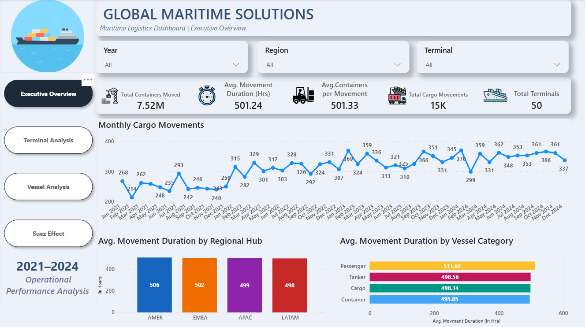
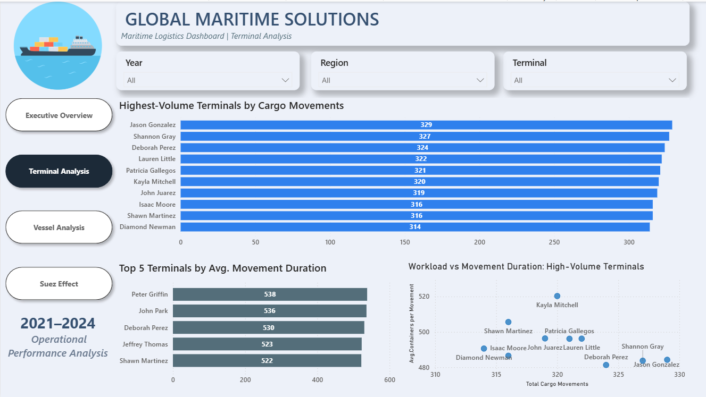
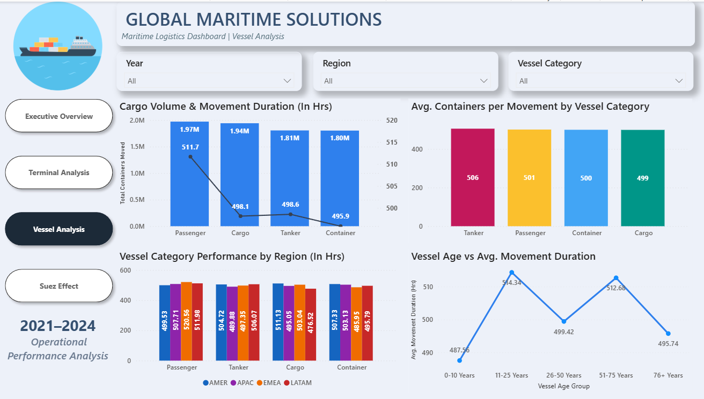
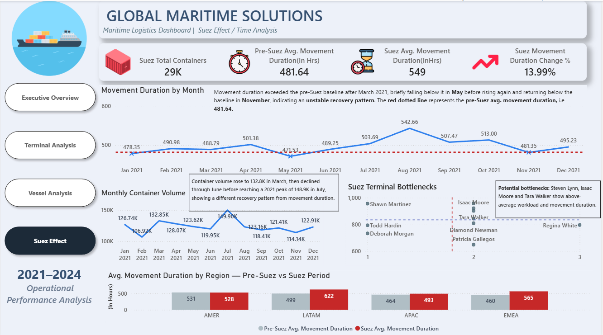

# 🚢 Maritime Logistics Operations Analysis | Power BI

## 📌 Project Overview

This project analyzes maritime cargo movement data from **2021 to 2024** using **Microsoft Power BI**.

The dashboard focuses on identifying operational bottlenecks, comparing efficiency across terminals, regions, and vessel categories, and analyzing the impact of the **2021 Suez Canal disruption** on cargo movement operations.

The analysis supports the business objective of identifying opportunities to improve operational efficiency and reduce cargo movement times.

---

## 🎯 Business Objectives

* Identify operational bottlenecks across terminals.
* Compare movement efficiency across regions and vessel categories.
* Analyze factors associated with longer cargo movement durations.
* Examine the impact of the 2021 Suez Canal disruption.
* Identify opportunities to reduce cargo movement times.

---

## 📊 Dashboard Pages

### 1️⃣ Executive Overview

Provides a high-level overview of maritime operations through key KPIs, cargo movement trends, regional performance, and vessel category analysis.

### 2️⃣ Terminal Analysis

Analyzes terminal performance to identify high-volume terminals, movement duration patterns, and potential operational bottlenecks.

### 3️⃣ Vessel Analysis

Examines operational performance across vessel categories and vessel age groups to understand their relationship with movement duration.

### 4️⃣ Suez Effect / Time Analysis

A focused analysis of the 2021 Suez Canal disruption, examining changes in cargo movement patterns and movement duration around the event.

---

## 🛠️ Tools & Skills Used

* **Microsoft Power BI**
* **Power Query** — Data Cleaning & Transformation
* **DAX** — Measures & Calculated Columns
* **Data Modeling** — Star Schema
* **Data Visualization & Dashboard Design**

---

## 📸 Dashboard Preview

### Executive Overview



### Terminal Analysis



### Vessel Analysis



### Suez Effect / Time Analysis



---

## 📁 Repository Contents

```text
Maritime-Logistics-Operations-Analysis/
│
├── README.md
├── Maritime Logistics Dashboard.pbix
│
├── data/
│   ├── dim_terminal.csv
│   ├── dim_time.csv
│   ├── dim_vessel.csv
│   └── fact_cargo_movements.csv
│
├── screenshots/
│   ├── Executive_Overview.png
│   ├── Terminal_Analysis.png
│   ├── Vessel_Analysis.png
│   └── Suez_Effect.png
│
└── challenge/
    └── CHALLENGE_BRIEF.md
```

---

## 👤 Author

**Amey Joshi**

Aspiring Data Analyst | Power BI | Data Analytics | Data Visualization
